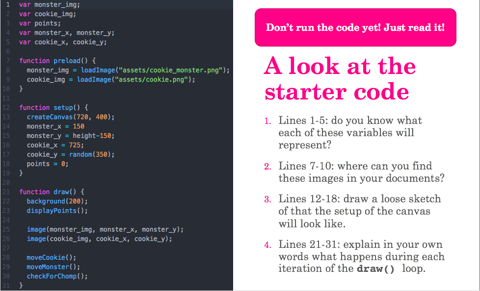
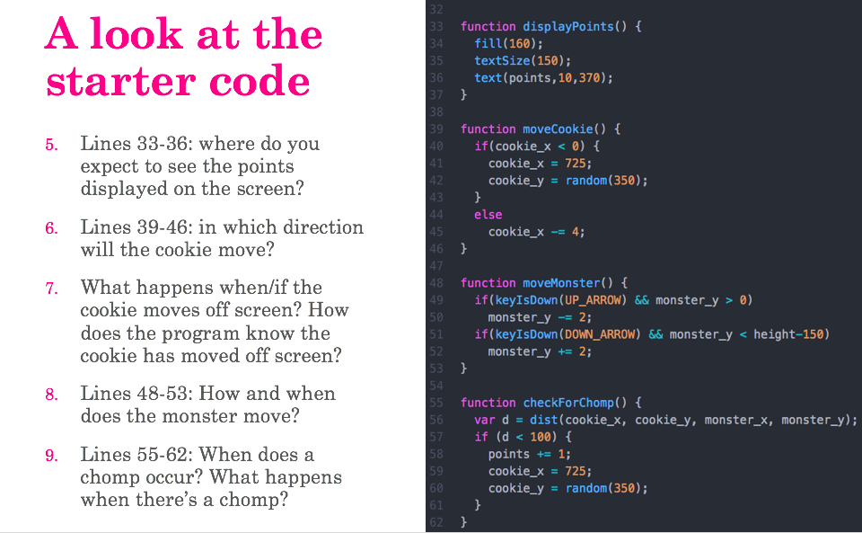

# Cookie Game

## Learning Goals
- Practice reading and then modifying code that you didn’t write
- Use variables to store and manipulate an object’s position
- Use conditionals to control when actions can and cannot occur
- Use a form button

## Cookie Game

### Reading code you didn't write
Before downloading and running the code, let's take a look at the starter code that you will be given. **It is a skill to be able to read code you didn't write.** A skill that you will need to use as a developer as you are most frequently integrating or modifying other people's code, rarely creating everything from scratch all by yourself.

With your partner, read the code and answer questions 1-9.

### Starter Files
OK, now that you have idea of what the starter code does, you can now grab the starter code and run it to see if you were correct.

Starter files: [game_starter.zip](game_starter.zip)

### Modifying the code (with a pair!)
1. Track the number of cookies that are missed and end the game after 3 misses
 - Decide: how do you want to track misses? With a number or with a string?
 - Decide: do you want to display the number of misses on the screen? How?
 - Decide: how are you going to end the game? Place a big message blocking the screen?
1. Add a piece of pie and a piece of cake that randomly appear and move on the screen to be eaten.
  - Make it so that eating the pie or cake count as a miss.
  - Decide: what do you want the images to look like? Where do you need to save them? I have provided some files that you can use if you choose (and can find them :-) )
  - Decide: how fast do you want the pie and cake move?
  - Decide: do you want it to be possible for all three items to appear at the same time? Or do you want them to appear one at a time?
  - Added Fun: how can you prevent the food items from overlapping each other?
1. Make the game be able to be restarted once it ends using a button.
  - Explore the Example: DOM --> InputButton for example

### Extensions
...Come up with and add at least _3_ of your own additions to the game!

Examples:
- Give Cookie Monster the ability to move in any direction, but not off the screen
- Make the cookies speed up every time you catch one
- Create a leaderboard where you track highest scores (optionally: figure out how to save and load these with a text file)
- Add sounds
